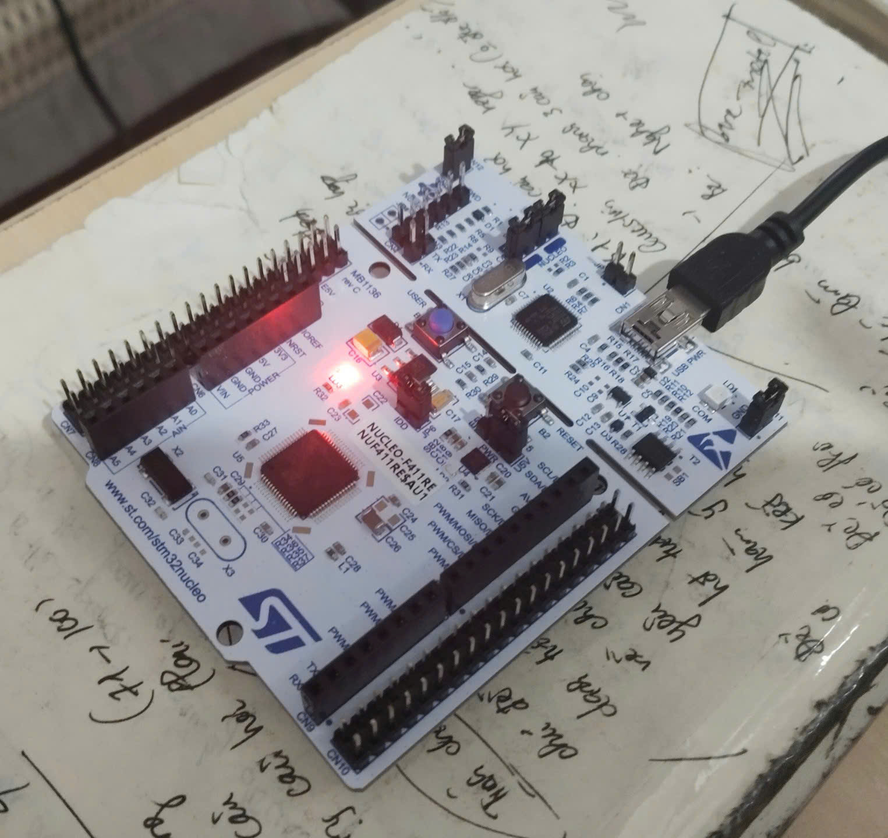

# PROJECT_01 blinking LED using bare-metal 
- In this project, I will demonstrate how to set up a bare-metal C project from scratch for the STM32F411RE microcontroller. 
- This includes finding register memory addresses in the Reference Manual, writing custom startup code and linker scripts, and understanding how embedded hardware operates under the hood without relying on HAL/SPL libraries
****
## Project purpose
- The project is the first challenge on my way to becoming an **Embedded Software Engineer**. 
- It serves as a hands-on learning milestone to master low-level register manipulation, build systems, and memory management, as well as a reference to look back on what I have gone through.
****
 
## Features
- 100% Bare-metal, no using HAL Library, direct peripheral register manipulation.
- Using STM32F411xC/E Reference Manual (RM0383) & Datasheet.
- Custom Startup Code: Interrupt Vector Table setup and `Reset_Handler` implementation in C
- Hardware Control: Toggling on-board User LED (LD2 - pin `PA5`) using RCC and GPIO registers.
## Project Structure
- the project has structure like this: 
```

├── Inc/
│   └── stm32f411re.h          # Memory map & register definitions (RCC, GPIO, etc.)
├── Src/
│   ├── main.c                 # Application logic (LED toggle loop & delays)
│   └── startup.c              # Vector table, stack initialization & Reset Handler
├── STM32F411RE_FLASH.ld       # Linker script defining Flash/RAM memory regions
└── README.md                  # Project documentation
```
****
## Hardware using
- in this project, i using ***NUCLEO-F411RE (STM32F411RET6)*** like a main microcontroller with target component is on-board User LED (LD2 connected to pin **PA5**)
- Debugger: On-board ST-LINK/V2-1 via Mini-USB cable

****
## Software using
- IDE: STM32CubeIDE
- Compiler Toolchain: Integrated GNU Arm Embedded Toolchain.
****
## Build project
**1. Import Project into STM32CubeIDE**
- Open STM32CubeIDE.
- Go to File -> Import... -> General -> Existing Projects into Workspace.
- Select the root folder of this project and click Finish.
**2. Build Project**
- Press Ctrl + B (or Cmd + B on Mac) or click the *Hammer icon* on the toolbar to compile the project.
- Verify that the compilation finishes with 0 errors, 0 warnings.
**3. Flash & Debug**
- Connect your NUCLEO-F411RE board to your PC using a Mini-USB cable.
Click the Run icon (▶) or Debug icon (ST-LINK GDB Server).
- STM32CubeIDE will automatically build, flash the firmware into Flash memory, and start execution.
****
## Usage
- Once flashed successfully, the User LED (LD2 on pin PA5) will start blinking at the programmed delay interval.
Insight:
`
Looking closely at register addresses in the reference manual helps reveal how hardware interacts directly with software—an essential understanding that higher-level libraries often conceal.
`
****
## Knowledgeable gained
Through building this bare-metal project from scratch, I have acquired key embedded systems engineering competencies:
- **Register-Level Programming:** Navigated the STM32F411 Reference Manual (RM0383) to calculate peripheral base addresses, offset values, and manipulate bit fields for RCC (Reset and Clock Control) and GPIO registers.
- **Cortex-M Boot Process & Startup Code:** Implemented a custom Vector Table and `Reset_Handler` in C to understand how the MCU transitions from power-on/reset to executing `main()`, including initializing `.data` sections in SRAM and clearing `.bss`.
- **Linker Script Anatomy (`.ld`):** Learned how to map memory spaces (FLASH vs. SRAM), manage Load Memory Addresses (LMA) vs. Virtual Memory Addresses (VMA), and define stack alignment.
- **Bitwise Operations:** Applied efficient bit-masking techniques (bit set, clear, toggle, read) in C for hardware manipulation.
- **IDE & Build System Mechanics:** Configured STM32CubeIDE to build bare-metal projects without relying on CubeMX code generators or HAL driver abstractions.
****